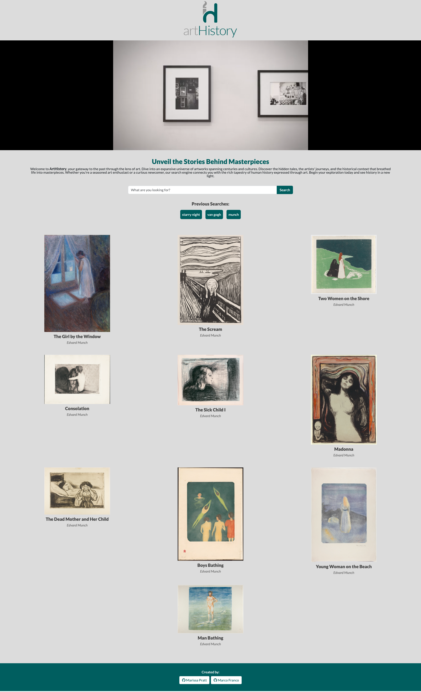
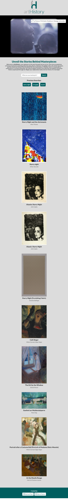
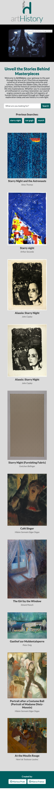

# artHistory - Unveil the Stories Behind Masterpieces

## Project Description
artHistory is a web application designed to simplify the exploration of art for enthusiasts and newcomers alike. Utilizing the Art Institute of Chicago API, it offers users instant access to a wide range of artworks, providing essential information such as the title, author, and a brief description. Additionally, the app incorporates the YouTube API to enrich the user experience with related video content. With features like search history saved in local storage for easy retrieval, artHistory makes discovering and revisiting the world of art effortless and enjoyable.

## Mock-Up
The following image shows the web application's appearance on desktops' screen:

The following image shows the web application's appearance on tablets' screen:

The following image shows the web application's appearance on smartphones' screen:

## Credits
- [w3schools.com](https://www.w3schools.com/)
- [developer.mozilla.org](https://developer.mozilla.org/en-US/)
- [getbootstrap.com](https://getbootstrap.com/docs/5.3/getting-started/introduction/)
- [api.artic.edu](https://api.artic.edu/docs/)
- [developers.google.com](https://developers.google.com/youtube/player_parameters)

## Repository and Webpage link

- [Repository Link](https://github.com/heeyitsrissa/art-history)
- [Deployed Application Link](https://heeyitsrissa.github.io/art-history)